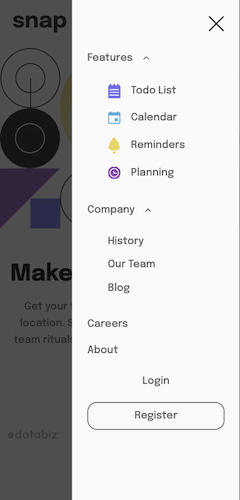
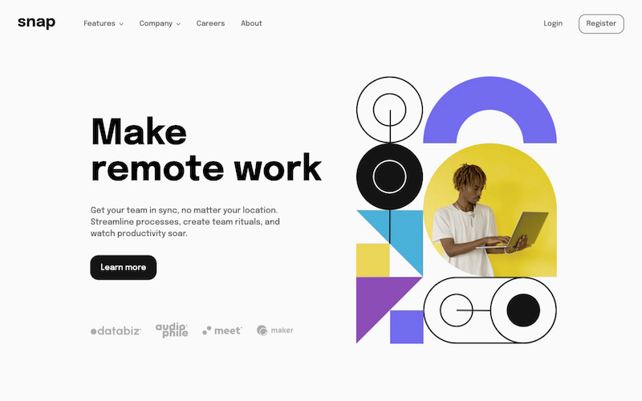
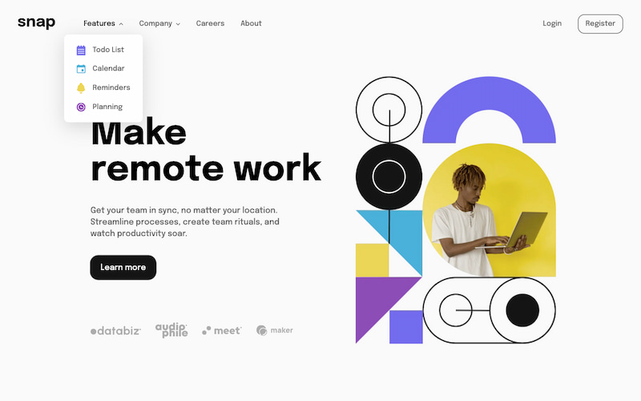

# Frontend Mentor - Intro section with dropdown navigation solution

This is Max Ruuen's solution to the [Intro section with dropdown navigation challenge on Frontend Mentor](https://www.frontendmentor.io/challenges/intro-section-with-dropdown-navigation-ryaPetHE5).

## Table of contents

- [Overview](#overview)
  - [The challenge](#the-challenge)
  - [Screenshot](#screenshot)
  - [Links](#links)
- [My process](#my-process)
  - [Built with](#built-with)
  - [What I learned](#what-i-learned)
  - [Useful resources](#useful-resources)
- [Running this solution locally](#running-this-solution-locally)
- [Author](#author)

## Overview

### The challenge

Users should be able to:

- View the relevant dropdown menus on desktop and mobile when interacting with the navigation links
- View the optimal layout for the content depending on their device's screen size
- See hover states for all interactive elements on the page

### Screenshot

#### Mobile Layout

#### Desktop Layout

### Links

- Solution URL: [Frontend Mentor](https://www.frontendmentor.io/solutions/intro-section-with-accessible-dropdown-navigation-using-scss-waWCqiz6IU)
- Live Site URL: [Netlify](https://mbr-challenge-dropdown-navigation.pages.dev/)

## My process

### Built with

- SCSS / BEM
- JavaScript
- Parcel

### What I learned

I found the greatest problem on this challenge was drawing the line between doing everything in CSS vs. shifting some of the load over to JavaScript in favour of reliability/simplicity. I'll need to do more practice and reading on some common progressive enhancement techniques as I've known about the concept for a while but never dove too deep into a lot of common use cases.

This challenge solidified a lot of small past learnings and allowed me to find some new stuff too, but I've identified areas of improvement and have asked the Frontend Mentor community for feedback on a few queries (which I will update here as I implement feedback).

I think the accessibility & screen reader experience is good on this challenge and I've made sure to implement the previous accessibility feedback from my other solutions. Some points of focus were:

- Not using separate nav elements for desktop/mobile navs
- Good accessible names which aren't overly descriptive and account for context as much as possible
- Keyboard & screen reader control of navigation on both mobile & desktop feel great and announce smoothly
- Proper placement of nav controls within nav element with respect to content
- Hiding non-essential decorative images
- Ensuring my animations had `prefers-reduced-motion` rules for users who disable animations

There were problems with CLS metrics being high due to variable hero image load times, and I struggled with this a bit before finding a decent solution. Part of my struggle was due to incorrect usage of `width`/`height` values causing unexpected behaviour, and I was able to resolve this after a fair bit of reading and cycling to other tasks for mental space.

Another part was solved with optimisation of the image assets into jpg/webp and applying compression, and additionally learning about preloading critical images. I'm a bit surprised there isn't [a better standard solution for preloading `<picture>` element sources](https://web.dev/articles/preload-responsive-images#preload_and_picture) including alternate types, but I ended up decided to preload only the WebP images as [the browser support for WebP and preloads align pretty closely.](https://www.bronco.co.uk/our-ideas/using-relpreload-for-responsive-images/)

I plan on spending more time understanding CLS prevention techniques and playing around with these, but I found utilising Chrome Dev Tool's Performance tab incredibly helpful for working through these issues.

I ran into a fun Safari bug where the `outline` property doesn't obey an element's `border-radius` property values, and thankfully this was fixed in Safari v16.4+.

- [WebKit bug tracker discussion](https://bugs.webkit.org/show_bug.cgi?id=20807#c28)
- [Safari Tech Preview 157 release notes containing fix](https://webkit.org/blog/13575/release-notes-for-safari-technology-preview-157/)
- [Safari 16.4 release notes containing fix](https://webkit.org/blog/13966/webkit-features-in-safari-16-4/)

This was my first time using Parcel and it's a lovely little build tool for these static site challenges - will definitely be using this in projects moving forward & exploring it more.

I am not enjoying SCSS nesting syntax as much as I used to and I'm going to move away from using this in future, and looking at some better solutions & ways other people use SCSS responsibly.

### Useful resources

- [Stephanie Eckles' article on CSS-only accessible dropdown navigations](https://moderncss.dev/css-only-accessible-dropdown-navigation-menu/)
- [CSS-Tricks article on CSS-only dropdown menus](https://css-tricks.com/solved-with-css-dropdown-menus/)
- [Kevin Powell's video on CSS megamenus](https://www.youtube.com/watch?v=mPLIIUcjpCA)
- [Logrocket article on dropdown menus](https://blog.logrocket.com/making-dropdown-menus-css/)
- [ARIA Authoring Practice Guide on accessible names and descriptions](https://www.w3.org/WAI/ARIA/apg/practices/names-and-descriptions/)
- [WIA docs on handling decorative images](https://www.w3.org/WAI/tutorials/images/decorative/)
- [web.dev article on optimising CLS](https://web.dev/articles/optimize-cls)
- [web.dev article on preloading](https://web.dev/articles/preload-critical-assets)
- [web.dev article on preloading sources for `<picture>` elements](https://web.dev/articles/preload-responsive-images#preload_and_picture)

## Running this solution locally

The project is a static site using Parcel as the build tool & dev server.

All site files are located in the `/src` directory & site files build into the `/dist` directory.

The development server can be started with `npm run dev` which runs on port 1234, and will be accessible on your local network. You can edit the `dev` script within `package.json` to disable this if required, by removing the `--host 0.0.0.0` flag from the `parcel` command.

A production build is performed with `npm run build`.

Both scripts will hard delete the existing `/dist` directory before triggering a new build, but you can clear this folder manually if the removal is not successful for any reason.

## Author

- Frontend Mentor - [@ruuen](https://www.frontendmentor.io/profile/ruuen)
- Twitter - [@maxruuen](https://www.twitter.com/maxruuen)
